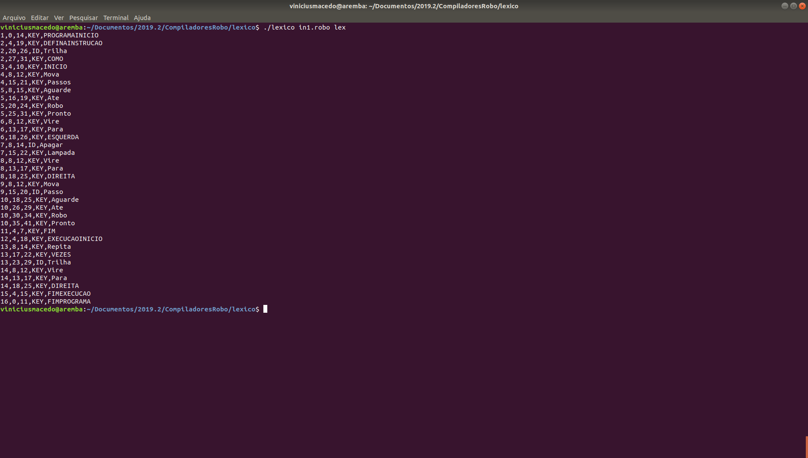
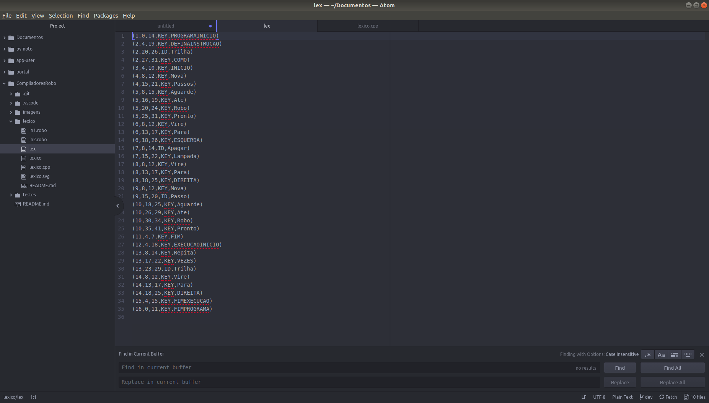
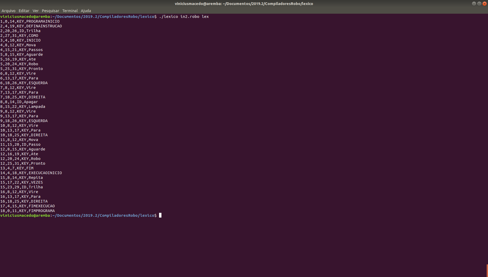
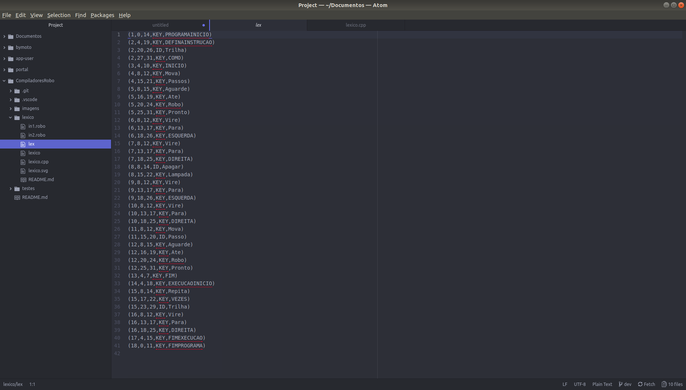
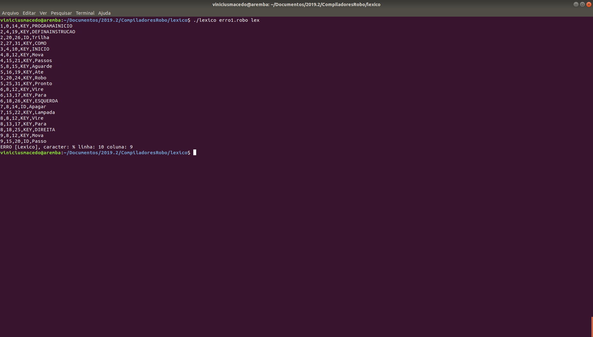
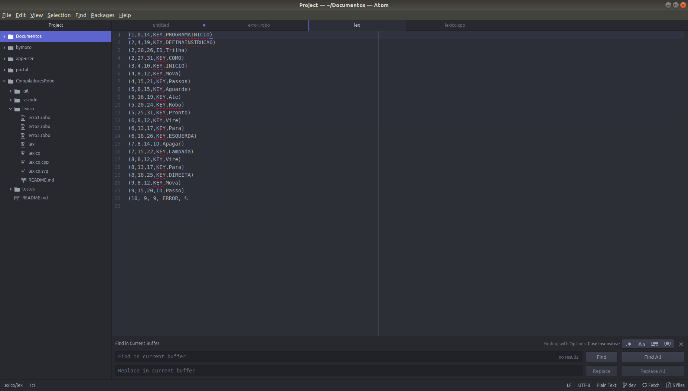
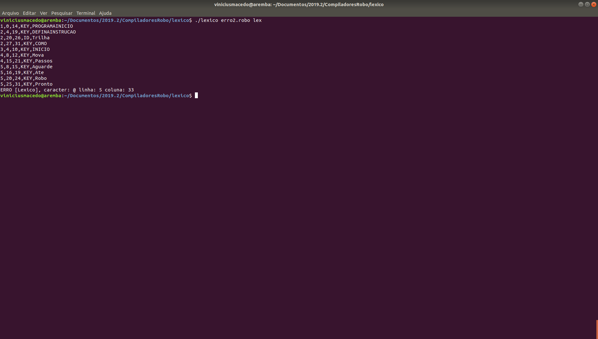
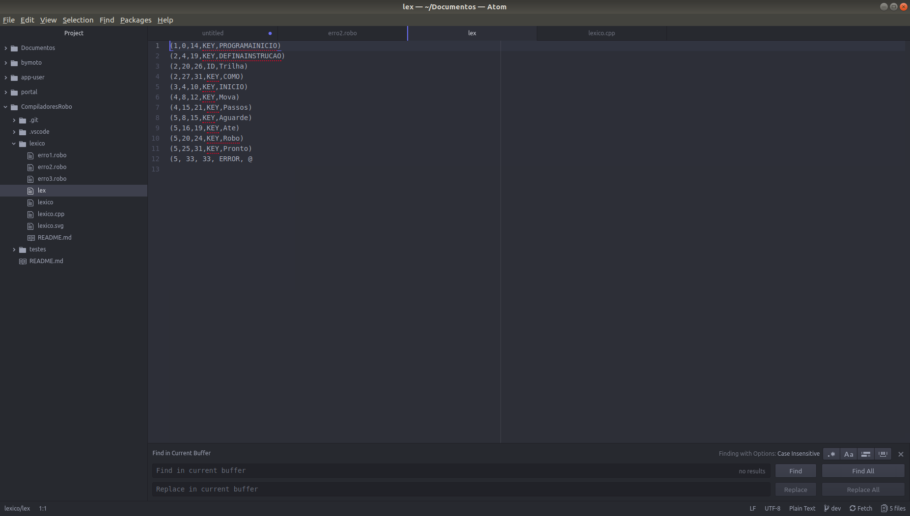
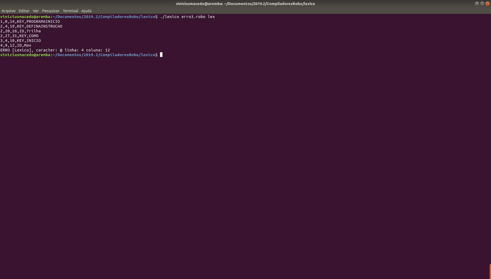
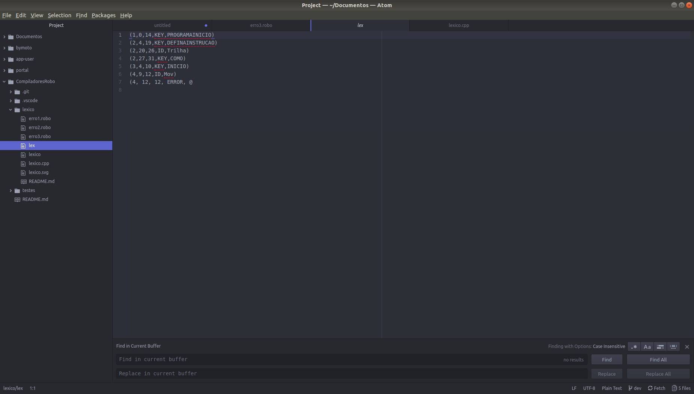

# Análise Léxica do Compilador

## Requisitos mínimos para o Léxico

O analisador Léxico detém os seguintes requisitos:

 - Deve ler a sequência de caracteres que compõe o código fonte do programa, identificando-os e agrupando-os em uma seqüência de *tokens* válidos da linguagem. | Não é permitido o uso de qualquer processador léxico (e.g.).
 - Deve ser capaz de identificar e reportar os erros léxicos encontrados no código fonte (e.g. símbolos desconhecidos ou identificador mal-formado). Para cada	 erro encontrado, deve-se informar o posicionamento (linha e coluna) no arquivo fonte de entrada em que o erro ocorreu.

## Sintaxe básica

BEGINNING-OF-PROGRAM

 new instructions

 BEGINNING-OF-EXECUTION
   main executable code
 END-OF-EXECUTION

END-OF-PROGRAM
Where new instructions is a list of definitions of the following form:
DEFINE-NEW-INSTRUCTION instruction-name AS
BEGIN
  instruction code
END

## Tokens

 - Os terminais estão descritos entre aspas duplas e em negrito.
 - O símbolo* representa zero ou mais ocorrências do não-terminal à esquerda deste símbolo.
 - Produções opcionais estão entre colchetes.
 - O compilador deve aceitar palavras escritas em minúsculas ou maiúsculas.
 - Comentários são definidos em linhas iniciadas com o símbolo “#”

## Regras definidas na especificação

    Programa ::= “programainicio” Declaracao* “execucaoinicio” Comando “fimexecucao” “fimprograma”
    Declaracao ::= “definainstrucao” identificador “como” Comando
    Bloco ::= “inicio” Comando* ”fim”
    Comando ::= Bloco | Iteracao | Laco | Condicional | Instrução
    Iteracao ::= “repita” Numero “vezes” Comando “fimrepita”
    Laço ::= “enquanto” Condicao “faca” Comando “fimpara”
    Condicional ::= “se” Condicao “entao” Comando “fimse” [“senao” Comando “fimsenao”]
    Instrucao ::= “mova” Numero* [“passos”] | “Vire Para” Sentido | Identificador | “Pare” | “Finalize” | “Apague Lampada”| “Acenda Lampada” | “Aguarde Ate” Condição
    Condicao ::= “Robo Pronto” | “Robo Ocupado” | “Robo Parado” | “Robo Movimentando” | “Frente Robo Bloqueada” | “Direita Robo Bloqueada” | “Esquerda Robo Bloqueada” | “Lampada Acessa a Frente” |”Lampada Apagada a Frente” | “Lampada Acessa A Esquerda” | “Lampada Apagada A Esquerda” | “Lampada Acessa A Direita” | “Lampada Apagada A Direita”
    Identificador ::= Letra(Letra|Digito)*
    Numero ::= Digito*
    Letra ::= “A” | “a” | “B” | “b” | ... | “z”
    Digito ::= “0” | ... | “9”
    Sentido ::= “esquerda” | “direita”

## Expressões Regulares

A expressões regulares necessária para o analizador léxico, são as descritas abaixo:

 - digito = [0 - 9]
 - letra = [a-zA-Z]
 - numero = (digito)*
 - id = letra(letra | digito)*

## Atômatos finitos deterministicos para a análise léxica

## Compilação

Pra compilar o código e utilizar a análise léxica do compilador faz-se necessário executar a compilação do arquivo "lexico.ccp", o qual pode ser realizado da seguinte forma: g++ lexico.cpp -o lexico

## Execução do compilador

A execução consiste em uma chamada, a qual deve ser especificado como parametros para a execução: o arquivo de entrada e o arquivo de saída, da seguinte forma: **'./compilador arquivodeentrada.robo arquivodesaida.lex'**.

## Arquivo de saída

O arquivo de saída consiste em um arquivo '.lex', o qual detém a seguinte estrutura: (Num_Linha, Numero_Coluna_Inicial, Numero_Coluna_Final, Tipo_Token,"Lexema").

## Erros

Os erros são mostrados no terminal e também são salvos no arquivo .lex de saída.

## Retorno do analisador léxico

O retorno do analisador léxico pode ser verificado nas imagens abaixo:

### Acertos

### Erros

